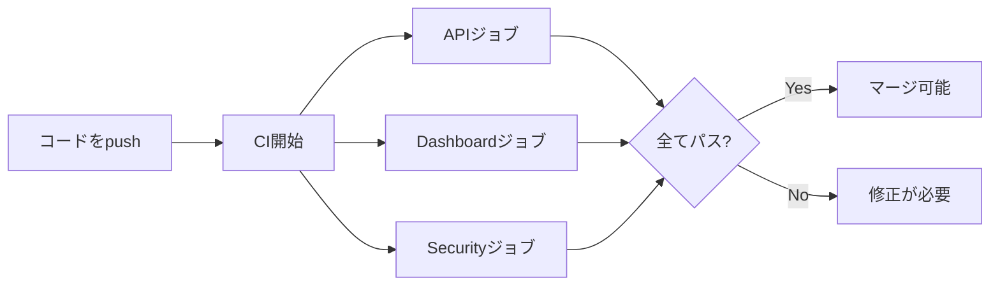
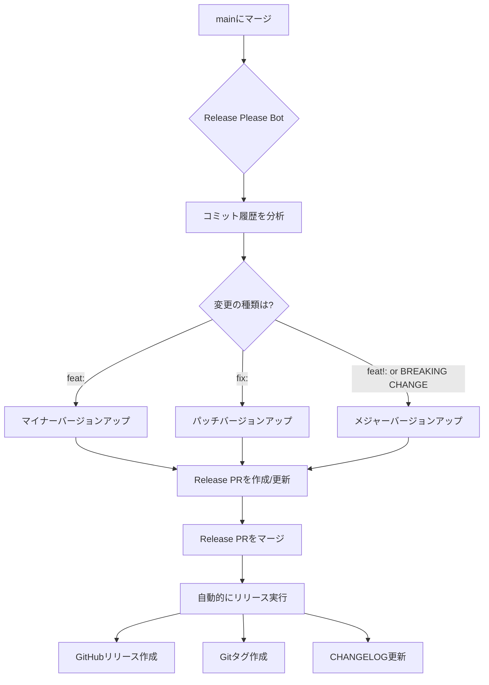
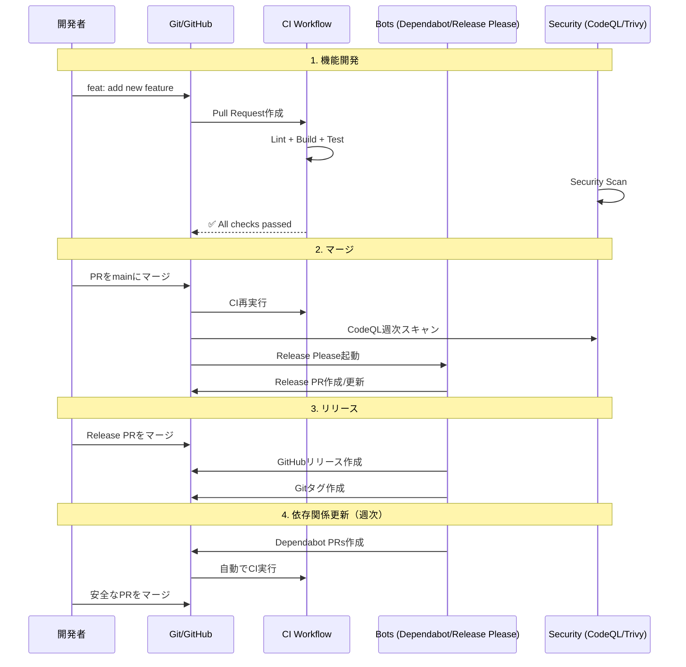

# GitHub Automation & CI/CD 解説

このディレクトリには、GitHub上で自動的に実行される各種ワークフローと設定ファイルがあります。

## 📁 ディレクトリ構造

```
.github/
├── README.md                    # このファイル
├── dependabot.yml               # 依存関係自動アップデート（Bot）
└── workflows/
    ├── ci.yml                   # CI/CD（テスト・ビルド）
    ├── codeql.yml              # セキュリティスキャン
    └── release-please.yml      # リリース自動化（Bot）
```

---

## 🤖 Bot（ボット）とは？

**「Bot」= 自動化されたプログラム**で、人間の代わりに定期的なタスクを実行します。

### このプロジェクトで使っているBot

| Bot | 役割 | 作業内容 |
|-----|------|---------|
| **Dependabot** | 依存関係の更新 | npm パッケージを自動アップデート |
| **Release Please** | リリース管理 | バージョン番号、CHANGELOG、リリースノートを自動生成 |

**メリット:**
- ✅ セキュリティパッチを自動適用
- ✅ 手作業を削減（バージョン管理、変更履歴）
- ✅ 人為的ミスを防止

---

## 📄 各ファイルの詳細

### 1. `dependabot.yml` - 依存関係自動アップデート Bot

#### 何をするBot？

**Dependabot**が、使っているライブラリ（npm パッケージ）を自動的にアップデートします。

#### いつ動く？

- **毎週1回**（月曜日）
- **2種類の依存関係**をチェック：
  1. **GitHub Actions** - CI/CDで使うツール
  2. **npm パッケージ** - Node.js のライブラリ

#### どう動く？

```yaml
# 例: Reactの新バージョンが出た場合
1. Dependabotが新しいバージョンを検知
2. 自動でPRを作成（タイトル: "chore: bump react from 18.2.0 to 18.3.0"）
3. CIが自動で走る（テスト・ビルド）
4. 開発者がPRをレビュー・マージ
```

#### 設定のポイント

```yaml
# メジャーバージョンは自動更新しない（破壊的変更の可能性）
ignore:
  - dependency-name: "*"
    update-types: ["version-update:semver-major"]

# 関連する依存関係をグループ化
groups:
  dev-dependencies:        # 開発用ツール（ESLint, TypeScriptなど）
  api-dependencies:        # API用（Express, PostgreSQLなど）
  dashboard-dependencies:  # Dashboard用（React, Vitなど）
```

**Semantic Versioning（SemVer）について:**
- `1.2.3` → `1.2.4` = **パッチ**（バグ修正）→ ✅ 自動更新
- `1.2.3` → `1.3.0` = **マイナー**（新機能）→ ✅ 自動更新
- `1.2.3` → `2.0.0` = **メジャー**（破壊的変更）→ ❌ 手動確認が必要

#### PR例

Dependabotが作成するPRは、以下のような情報を含みます：

- 📦 パッケージ名とバージョン
- 📝 変更内容（CHANGELOG）
- 🔒 セキュリティ脆弱性情報
- ✅ 互換性チェック結果

---

### 2. `workflows/ci.yml` - CI/CD ワークフロー

#### 何をする？

**コードの品質を自動チェック**します。

#### いつ動く？

- **Pull Request作成時**
- **mainブランチへのpush時**
- **手動実行**（`workflow_dispatch`）

#### どう動く？



#### 3つのジョブ（並列実行）

##### 📦 **1. API ジョブ**

```yaml
steps:
  1. コードをチェックアウト
  2. Node.js 20 をセットアップ
  3. 依存関係をインストール（npm ci）
  4. ESLintでコードをチェック
  5. TypeScriptでビルド
  6. 脆弱性スキャン（npm audit）
```

**チェック内容:**
- ✅ コードスタイル（ESLint）
- ✅ 型エラー（TypeScript）
- ✅ ビルド成功
- ✅ セキュリティ脆弱性（npm audit）

##### 📊 **2. Dashboard ジョブ**

API ジョブと同じ流れで、Dashboardアプリをチェックします。

##### 🔒 **3. Security ジョブ**

```yaml
steps:
  1. コードをチェックアウト
  2. Trivy スキャナーを実行
     - ファイルシステム全体をスキャン
     - CRITICAL & HIGH の脆弱性を検知
  3. 結果をGitHub Security タブにアップロード
```

**Trivy とは？**
- オープンソースのセキュリティスキャナー
- 依存関係の既知の脆弱性を検出
- 設定ミス（Dockerfileなど）も検出

#### 並列実行の利点

```
従来（直列実行）: API → Dashboard → Security = 15分
現在（並列実行）: API + Dashboard + Security = 5分
```

**3倍速い！** ⚡

#### Concurrency（同時実行制御）

```yaml
concurrency:
  group: ${{ github.workflow }}-${{ github.ref }}
  cancel-in-progress: true
```

**効果:**
- 同じブランチで新しいpushをすると、古い実行をキャンセル
- リソースの無駄を削減
- 最新のコードだけをチェック

---

### 3. `workflows/codeql.yml` - セキュリティ分析

#### 何をする？

**GitHubの高度なセキュリティスキャン**（CodeQL）

#### CodeQL とは？

GitHubが開発した**静的解析エンジン**：
- コードをデータベース化して分析
- セキュリティ脆弱性を検出
- コード品質の問題を検出

**具体例:**
```typescript
// 悪い例: SQLインジェクションの脆弱性
const query = `SELECT * FROM users WHERE id = ${req.params.id}`;

// CodeQLが検出 → GitHub Security タブに警告表示
```

#### いつ動く？

1. **mainブランチへのpush**
2. **Pull Request作成時**
3. **毎週月曜日0時**（定期スキャン）

```yaml
schedule:
  - cron: '0 0 * * 1'  # Weekly on Monday at midnight
```

#### どう動く？

```yaml
steps:
  1. CodeQL初期化
     - 言語: JavaScript/TypeScript
     - クエリ: security-extended, security-and-quality
  2. 自動ビルド（コードを解析用に変換）
  3. CodeQL分析実行
  4. 結果をGitHub Security タブに表示
```

#### チェック内容

- 🛡️ **セキュリティ:**
  - SQLインジェクション
  - XSS（クロスサイトスクリプティング）
  - パストラバーサル
  - 認証・認可の問題
  
- 🎯 **コード品質:**
  - デッドコード
  - 非推奨APIの使用
  - パフォーマンスの問題

#### 結果の確認方法

```
GitHub リポジトリ
→ Security タブ
→ Code scanning alerts
→ 検出された問題一覧
```

---

### 4. `workflows/release-please.yml` - リリース自動化 Bot

#### 何をするBot？

**Release Please Bot**が、**リリースを自動化**します。

#### リリースプロセス（従来 vs 自動化）

**従来（手動）:**
```bash
1. CHANGELOG.md を手作業で編集
2. package.json のバージョンを変更
3. Git タグを作成（v1.0.0）
4. GitHubリリースノートを作成
5. コミット・プッシュ
```
**問題点:** 手間がかかる、ミスしやすい

**自動化後:**
```bash
1. Conventional Commitsでコミット
   git commit -m "feat: add user authentication"
2. mainにマージ
3. Release Please Botが全部やる！
```

#### いつ動く？

**mainブランチへのpush時**に自動実行

#### どう動く？



#### Conventional Commits（重要！）

Release Pleaseは、コミットメッセージから**変更の種類を判断**します。

| コミットメッセージ | バージョン変更 | 例 |
|------------------|---------------|-----|
| `feat: 新機能` | マイナー（0.1.0 → 0.2.0） | `feat: add dark mode` |
| `fix: バグ修正` | パッチ（0.1.0 → 0.1.1） | `fix: correct calculation error` |
| `feat!: 破壊的変更` | メジャー（0.1.0 → 1.0.0） | `feat!: change API response format` |
| `docs: ドキュメント` | バージョン変更なし | `docs: update README` |
| `chore: 雑務` | バージョン変更なし | `chore: update dependencies` |

**BREAKING CHANGE（破壊的変更）の例:**
```bash
git commit -m "feat!: change API endpoint structure

BREAKING CHANGE: /api/data endpoint is now /api/v2/data
Old clients must update their API calls."
```

#### 設定ファイル

##### `release-please-config.json`

```json
{
  "include-component-in-tag": true,    // タグに "dashboard" や "api" を含める
  "tag-separator": "-",                 // dashboard-v1.0.0 のような形式
  "packages": {
    "apps/dashboard": {
      "release-type": "node",           // Node.jsプロジェクト
      "component": "dashboard"          // コンポーネント名
    },
    "apps/api": {
      "release-type": "node",
      "component": "api"
    }
  }
}
```

##### `release-please-manifest.json`

```json
{
  "apps/dashboard": "1.0.0",   // 現在のバージョン
  "apps/api": "1.0.0"
}
```

#### Release PRの例

Release Pleaseが作成するPR:

```markdown
## Dashboard v1.1.0

### Features
* add dark mode toggle (#123)
* implement user preferences (#124)

### Bug Fixes
* fix calculation error in waste chart (#125)

---

## API v1.0.1

### Bug Fixes
* correct SQL query for product data (#126)
```

#### リリースの流れ（実例）

1. **開発:**
   ```bash
   git commit -m "feat: add user authentication"
   git commit -m "fix: correct login validation"
   git push
   ```

2. **mainにマージ:**
   - Release Please Botが起動
   - 既存のRelease PRがあれば更新、なければ新規作成

3. **Release PRの確認:**
   - CHANGELOG を確認
   - バージョン番号を確認（feat だから 1.0.0 → 1.1.0）

4. **Release PRをマージ:**
   - 自動的にGitタグ作成（`dashboard-v1.1.0`）
   - GitHubリリース作成
   - `release-please-manifest.json` 更新

---

## 📝 Release Pleaseの実際の使い方

### 初回セットアップ（必須）

**GitHub Actions にPR作成権限を付与：**

1. リポジトリ設定を開く：
   ```bash
   https://github.com/<owner>/<repo>/settings/actions
   ```

2. **Workflow permissions** で以下を選択：
   - ✅ **"Read and write permissions"**
   - ✅ **"Allow GitHub Actions to create and approve pull requests"**

3. **Save** をクリック

**この設定をしないとRelease PRが作成されません！**

---

### 日常的な使い方（ステップバイステップ）

#### ステップ1: Conventional Commitsでコミット

```bash
# 新機能の追加（マイナーバージョンアップ）
git commit -m "feat(api): add user authentication"

# バグ修正（パッチバージョンアップ）
git commit -m "fix(dashboard): correct calculation error"

# 破壊的変更（メジャーバージョンアップ）
git commit -m "feat!(api): change API response format

BREAKING CHANGE: response now returns array instead of object"
```

**重要:** `apps/api` または `apps/dashboard` 配下のファイルを変更する必要があります。`.github/`の変更だけではリリースは作成されません。

#### ステップ2: mainブランチにマージ

```bash
# PR経由でマージ（推奨）
gh pr create --title "feat(api): add user authentication"
gh pr merge <PR番号> --squash

# または直接push（非推奨）
git push origin main
```

#### ステップ3: Release PRが自動作成される

数秒後、Release Pleaseが以下を作成します：

- **Release PR**: `chore: release main`
- **内容**: バージョンアップ、CHANGELOG、package.json更新

```bash
# Release PRを確認
gh pr list --label "autorelease: pending"

# または
gh pr list | grep "chore: release"
```

#### ステップ4: Release PRの内容を確認

```bash
# PRの詳細を表示
gh pr view <Release PR番号>

# 確認ポイント:
# ✅ バージョン番号が正しいか（1.0.0 → 1.1.0）
# ✅ CHANGELOGが正確か
# ✅ 全ての変更が含まれているか
```

#### ステップ5: Release PRをマージ

```bash
gh pr merge <Release PR番号> --squash
```

**マージすると自動的に：**
- ✅ GitHubリリースが作成される
- ✅ Gitタグが作成される（`api-v1.1.0`）
- ✅ `release-please-manifest.json`が更新される

#### ステップ6: リリースを確認

```bash
# リリース一覧を表示
gh release list

# 特定のリリースを表示
gh release view api-v1.1.0

# ブラウザで確認
gh repo view --web
# → "Releases" タブをクリック
```

---

### 設定ファイルの役割

| ファイル | 役割 | 編集方法 |
|---------|------|---------|
| **`release-please-config.json`** | **設定ファイル** | ✅ 手動で編集可能 |
| **`release-please-manifest.json`** | **現在のバージョン記録** | ❌ Release Pleaseが自動更新（触らない） |

#### `release-please-config.json`（設定）

```json
{
  "include-component-in-tag": true,     // タグ名: api-v1.0.0
  "tag-separator": "-",                  // セパレータ
  "packages": {
    "apps/dashboard": {
      "release-type": "node",            // Node.jsプロジェクト
      "component": "dashboard"           // コンポーネント名
    },
    "apps/api": {
      "release-type": "node",
      "component": "api"
    }
  }
}
```

#### `release-please-manifest.json`（バージョン記録）

```json
{
  "apps/dashboard": "1.0.0",  // Release Pleaseが自動更新
  "apps/api": "1.1.0"          // 手動で変更しても意味がない
}
```

**重要:** `manifest.json`を直接編集してもバージョンは変わりません。Conventional Commitsでコミットしてください。

---

### よくある問題と解決方法

#### 問題1: Release PRが作成されない

**原因:**
- GitHub Actionsの権限が不足
- `apps/`配下のファイルが変更されていない
- Conventional Commits形式でコミットしていない

**解決方法:**

```bash
# 1. 権限を確認
# Settings → Actions → Workflow permissions
# → "Read and write permissions" + "Allow PR creation"

# 2. 実際に変更があるか確認
git log --oneline -5 | grep "feat\|fix"

# 3. Release Pleaseログを確認
gh run list --workflow=release-please.yml --limit 1
gh run view <run-id> --log | grep "No user facing"
```

#### 問題2: Releasesに何も表示されない

**原因:** Release PRをまだマージしていない

**解決方法:**

```bash
# Release PRを探す
gh pr list --label "autorelease: pending"

# マージする
gh pr merge <PR番号> --squash

# リリースを確認
gh release list
```

#### 問題3: バージョンが意図した通りに変わらない

**原因:** コミットメッセージの形式が間違っている

**解決方法:**

| やりたいこと | 正しいコミットメッセージ |
|------------|------------------------|
| マイナーアップ (1.0.0 → 1.1.0) | `feat(api): add new feature` |
| パッチアップ (1.0.0 → 1.0.1) | `fix(api): bug fix` |
| メジャーアップ (1.0.0 → 2.0.0) | `feat!(api): breaking change` |

#### 問題4: 複数のパッケージを同時にリリースしたい

**解決方法:**

```bash
# 両方のディレクトリを変更
git commit -m "feat(api): add new endpoint"
git commit -m "feat(dashboard): add new UI component"
git push

# Release PRに両方の変更が含まれる
```

---

### 手動実行（トラブルシューティング用）

```bash
# Release Pleaseを手動で実行
gh workflow run release-please.yml

# 実行状態を確認
gh run list --workflow=release-please.yml --limit 1

# ログを確認
gh run view <run-id> --log
```

---

### ファイル名の由来

**"Release Please"** = Google製のツール名

- ツール名: **Release Please**（Googleが開発）
- 設定ファイル: `release-please-config.json`
- マニフェスト: `release-please-manifest.json`

**ベストプラクティスか？**
- ✅ Yes、これが公式のデフォルトファイル名
- ✅ 変更不可（Release Pleaseがこのファイル名を期待）
- ✅ Google、Microsoft、多くのOSSプロジェクトで使用

---

## 🔄 ワークフローの連携

### 典型的な開発フロー



### 各ワークフローの役割分担

| フェーズ | ワークフロー | 役割 |
|---------|------------|------|
| **開発中** | `ci.yml` | コードの品質担保 |
| **PR作成時** | `ci.yml` + `codeql.yml` | テスト + セキュリティチェック |
| **mainマージ後** | `release-please.yml` | リリース準備 |
| **週次** | `dependabot.yml` + `codeql.yml` | 依存関係更新 + 定期セキュリティスキャン |

---

## 📊 GitHub Security タブの使い方

### 見られる情報

```
GitHub リポジトリ → Security タブ
├── Code scanning alerts       # CodeQL + Trivy の結果
├── Dependabot alerts          # 脆弱性がある依存関係
├── Secret scanning            # 漏洩したトークンなど
└── Security advisories        # プロジェクトのセキュリティ情報
```

### アラート例

**例1: CodeQLが検出**
```
Medium severity: SQL injection vulnerability
File: apps/api/src/controllers/dataController.ts
Line: 45
```

**例2: Trivyが検出**
```
High severity: express@4.17.1 has known vulnerability
CVE-2022-24999: Update to express@4.18.2 or later
```

**例3: Dependabotが検出**
```
Critical severity: pg@8.7.1 has SQL injection vulnerability
Fixed in: pg@8.8.0
Action: Dependabot will automatically create a PR
```

---

## 🛠️ 開発者がすべきこと

### 1. Pull Request作成時

- [ ] CIが**全てパス**するまで修正
- [ ] CodeQLの警告を確認・修正
- [ ] Trivyの脆弱性警告を確認

### 2. コミットメッセージ

**Conventional Commitsを使う:**

```bash
# 良い例
git commit -m "feat: add user authentication"
git commit -m "fix: correct calculation in waste chart"
git commit -m "docs: update API documentation"
git commit -m "chore: update dependencies"

# 悪い例
git commit -m "update"           # ❌ 何をしたか不明
git commit -m "fixed stuff"      # ❌ 具体性がない
git commit -m "add feature"      # ❌ feat: プレフィックスがない
```

**詳細は `CONTRIBUTING.md` を参照**

### 3. Dependabot PR の対応

```bash
1. Dependabot が PR を作成
2. CIの結果を確認（自動で走る）
3. CHANGELOG を確認
   - パッチ/マイナー更新 → 通常は安全
   - メジャー更新 → 破壊的変更の可能性
4. ローカルでテスト（必要に応じて）
   gh pr checkout <PR番号>
   npm ci
   npm run dev-api
5. 問題なければマージ
```

### 4. Release PR の対応

```bash
1. Release Please が PR を作成
2. CHANGELOG を確認
   - すべての変更が含まれているか
   - バージョン番号が適切か
3. Release PR をマージ
   → 自動的にリリースが作成される
```

---

## 🔍 トラブルシューティング

### CI が失敗する

#### Lint エラー

```bash
# ローカルで確認
npm run lint:api
npm run lint:dashboard

# 自動修正
npm run lint:api -- --fix
```

#### ビルドエラー

```bash
# ローカルでビルド
npm run build:api
npm run build:dashboard

# 型エラーを確認
npm run build:api 2>&1 | grep error
```

#### 脆弱性エラー

```bash
# 詳細確認
npm audit

# 自動修正（可能な場合）
npm audit fix

# 手動更新
npm update <package-name>
```

### CodeQL が警告を出す

1. **GitHub Security タブで詳細確認**
2. **推奨される修正を適用**
3. **ローカルでテスト**
4. **再度push → CodeQL再実行**

### Release Please が動かない

#### よくある原因

1. **コミットメッセージが Conventional Commits 形式でない**
   ```bash
   # 悪い例
   git commit -m "update"
   
   # 良い例
   git commit -m "feat: add user authentication"
   ```

2. **全てのコミットが chore/docs だけ**
   - `feat:` や `fix:` がないとバージョンアップしない

3. **Release PR が既に存在する**
   - 既存の Release PR を確認（更新されているはず）

### Dependabot PR がマージできない

#### CI が失敗する場合

```bash
# ローカルで確認
gh pr checkout <PR番号>
npm ci
npm run lint
npm run build

# 問題があれば修正してコミット
git add .
git commit -m "fix: resolve compatibility issue"
git push
```

#### 競合が発生した場合

```bash
# Dependabot PRを更新
# PR画面で "Update branch" ボタンをクリック
# または、Dependabotに再作成を依頼
@dependabot recreate
```

---

## 📚 関連ドキュメント

- [CONTRIBUTING.md](../CONTRIBUTING.md) - 開発ガイドライン（Conventional Commits含む）
- [DEVELOPMENT.md](../DEVELOPMENT.md) - 開発環境セットアップ
- [deployment/README.md](../deployment/README.md) - デプロイ方法

---

## 🔗 外部リソース

### GitHub Actions

- [GitHub Actions Documentation](https://docs.github.com/en/actions)
- [Workflow Syntax](https://docs.github.com/en/actions/using-workflows/workflow-syntax-for-github-actions)

### Bots & Security

- [Dependabot Documentation](https://docs.github.com/en/code-security/dependabot)
- [CodeQL Documentation](https://codeql.github.com/docs/)
- [Trivy Scanner](https://github.com/aquasecurity/trivy)
- [Release Please](https://github.com/googleapis/release-please)

### Commit Conventions

- [Conventional Commits](https://www.conventionalcommits.org/)
- [Semantic Versioning](https://semver.org/)

---

## 💡 まとめ

### Bot（ボット）の役割

| Bot | いつ動く | 何をする | 開発者の作業 |
|-----|---------|---------|------------|
| **Dependabot** | 毎週月曜日 | 依存関係をアップデート | PRをレビュー・マージ |
| **Release Please** | mainマージ時 | リリースを自動化 | Release PRをマージ |

### ワークフローの役割

| ワークフロー | いつ動く | 何をする | 結果 |
|------------|---------|---------|------|
| **CI** | PR作成/main push | Lint + Build + Test | ✅ or ❌ |
| **CodeQL** | PR作成/main push/毎週月曜日 | セキュリティ分析 | Security タブに表示 |
| **Trivy** | PR作成/main push | 脆弱性スキャン | Security タブに表示 |

### 開発者がすること

1. ✅ **Conventional Commits でコミット**
2. ✅ **CIを全てパスさせる**
3. ✅ **Dependabot PR を定期的にマージ**
4. ✅ **Release PR をマージしてリリース**
5. ✅ **Security タブを定期的に確認**

**これだけで、高品質なコードとスムーズなリリースが自動化されます！** 🚀
