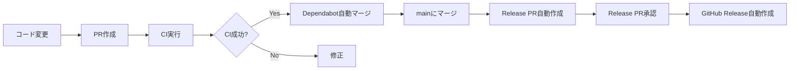
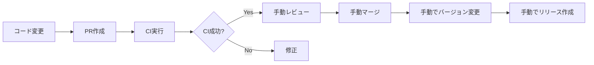

# Enterprise環境向けWorkflow設定ガイド

会社のリポジトリでGitHub Actionsを使用する際の制限事項と対応方法を説明します。

## 🚫 会社リポジトリの制限事項

### 1. Actions Permissions

**制限内容：**
```
❌ All actions and reusable workflows（全てのActionを許可）
✅ Allow enterprise, and select non-enterprise, actions and reusable workflows
```

**影響：**
- GitHub公式Actions（`actions/*`、`github/*`）は使用可能
- サードパーティActions（例：`aquasecurity/trivy-action`）は**事前承認が必要**

### 2. Workflow Permissions

**制限内容：**
```
❌ Read and write permissions
✅ Read repository contents permission
❌ Allow GitHub Actions to create and approve pull requests
```

**影響：**
- ✅ コードの読み取り、ビルド、テスト → **可能**
- ❌ PR作成、マージ、タグ作成、リリース作成 → **不可能**
- ❌ Dependabot自動マージ → **不可能**
- ❌ Release Please → **不可能**

---

## 📂 会社用に追加すべきファイル

### ✅ 使用可能（修正不要）

| ファイル | 状態 | 理由 |
|---------|------|------|
| **`.github/workflows/ci-enterprise.yml`** | ✅ **そのまま使える** | Read権限のみ、GitHub公式Actionのみ使用 |
| **`.github/workflows/codeql.yml`** | ✅ **そのまま使える** | GitHub公式のセキュリティ機能 |
| **`.github/dependabot.yml`** | ✅ **そのまま使える** | Dependabotは動作（自動マージは不可） |
| **`.gitattributes`** | ✅ **そのまま使える** | Git設定ファイル |

### ❌ 使用不可（参考として残す）

| ファイル | 状態 | 理由 | 対処法 |
|---------|------|------|--------|
| **`.github/workflows/dependabot-auto-merge.yml`** | ❌ **動かない** | `contents: write`、`pull-requests: write`が必要 | 手動でDependabot PRをマージ |
| **`.github/workflows/release-please.yml`** | ❌ **動かない** | PR作成権限が必要 | 手動でバージョン管理 |

### ⚠️ 要確認（修正が必要かも）

| ファイル | 状態 | 確認事項 |
|---------|------|---------|
| **`.github/workflows/ci.yml`** | ⚠️ **Trivy使用時** | `aquasecurity/trivy-action`が許可リストにあるか確認 |

---

## 🔧 会社リポジトリへのセットアップ手順

### Step 1: 必須ファイルをコピー

会社のリポジトリに以下をコピー：

```bash
# 必須ファイル
.gitattributes                                    # ✅ 修正不要
.github/workflows/ci-enterprise.yml               # ✅ 修正不要（メインCI）
.github/workflows/codeql.yml                      # ✅ 修正不要
.github/dependabot.yml                            # ✅ 修正不要

# オプション（参考として）
.github/workflows/ci.yml                          # 参考用（Trivy使用）
.github/workflows/dependabot-auto-merge.yml       # 参考用（個人用）
.github/workflows/release-please.yml              # 参考用（個人用）
.github/README.md                                 # ドキュメント
release-please-config.json                        # 参考用
release-please-manifest.json                      # 参考用
```

### Step 2: Trivy Actionの確認

**会社のActions許可リストを確認：**

Settings → Actions → General → "Allow select actions and reusable workflows"

#### ケース1: Trivyが許可されている場合

`ci-enterprise.yml`の`security`ジョブをそのまま使用

#### ケース2: Trivyが許可されていない場合

`ci-enterprise.yml`を編集：

```yaml
# security ジョブをコメントアウト
# security:
#   name: Security Scan (Trivy)
#   ...

# security-npm ジョブを使用（npm auditで代替）
security-npm:
  name: Security Scan (npm audit)
  runs-on: ubuntu-latest
  ...
```

### Step 3: 動作確認

1. **PRを作成**
   ```bash
   git checkout -b test-ci
   git commit --allow-empty -m "test: CI動作確認"
   git push -u origin test-ci
   ```

2. **CIの実行を確認**
   - GitHub → Actions タブ
   - "CI (Enterprise-Compatible)" が実行される
   - ✅ 全てグリーンなら成功

3. **エラーが出た場合**
   - エラーメッセージを確認
   - 使用できないActionがあれば削除または代替

---

## 📊 機能比較表

### 個人リポジトリ vs 会社リポジトリ

| 機能 | 個人 | 会社 | 代替策 |
|------|------|------|--------|
| **CI/CD（lint & build）** | ✅ | ✅ | なし（そのまま使える） |
| **セキュリティスキャン（npm audit）** | ✅ | ✅ | なし（そのまま使える） |
| **セキュリティスキャン（Trivy）** | ✅ | ⚠️ | 要確認（許可リストによる） |
| **CodeQL分析** | ✅ | ✅ | なし（そのまま使える） |
| **Dependabot更新通知** | ✅ | ✅ | なし（そのまま使える） |
| **Dependabot自動マージ** | ✅ | ❌ | 手動マージ |
| **Release Please（自動リリース）** | ✅ | ❌ | 手動でバージョン管理 |

---

## 🎯 会社リポジトリでできること

### ✅ できる（Read権限で可能）

1. **Pull Request時の自動CI**
   - Lint
   - Build
   - Test
   - セキュリティスキャン（npm audit）

2. **mainブランチへのpush時のCI**
   - 同上

3. **CodeQLによるセキュリティ分析**
   - 脆弱性の自動検出

4. **Dependabotの更新通知**
   - PRは自動作成される（マージは手動）

### ❌ できない（Write権限が必要）

1. **PR作成・マージの自動化**
   - Dependabot自動マージ
   - Release PRの自動作成

2. **タグ・リリースの自動作成**
   - Release Please

3. **Commitの自動作成**
   - フォーマットの自動修正など

---

## 🔄 ワークフロー比較

### 個人リポジトリのワークフロー



### 会社リポジトリのワークフロー



**違い：**
- ❌ 自動マージ → 👤 手動マージ
- ❌ 自動リリース → 👤 手動リリース

---

## 📝 Dependabotの手動マージ手順

会社リポジトリでは自動マージできないため、手動で行う：

### 1. Dependabot PRを確認

```bash
gh pr list --author "dependabot[bot]"
```

### 2. CIが通っているか確認

```bash
gh pr view <PR番号> --json statusCheckRollup
```

### 3. マージ

```bash
# Patch/Minor更新（安全）
gh pr merge <PR番号> --squash --delete-branch

# Major更新（要注意）
# まずローカルで動作確認してからマージ
```

---

## 🏷️ リリース作成の手動手順

### 方法1: GitHub UIで作成

1. GitHub → Releases → "Create a new release"
2. Tag: `api-v1.2.0` or `dashboard-v1.2.0`
3. Release notes: 自動生成または手動入力

### 方法2: CLIで作成

```bash
# APIのリリース
gh release create api-v1.2.0 \
  --title "API v1.2.0" \
  --notes "## What's Changed
- Feature A
- Bug fix B"

# Dashboardのリリース
gh release create dashboard-v1.2.0 \
  --title "Dashboard v1.2.0" \
  --notes "## What's Changed
- Feature C
- Enhancement D"
```

---

## 🛡️ セキュリティの担保

### Read-only権限でもセキュリティは確保できる

| 項目 | 方法 | 効果 |
|------|------|------|
| **依存関係の脆弱性** | `npm audit` | ✅ 検出可能 |
| **コードの脆弱性** | CodeQL | ✅ 検出可能 |
| **ファイルシステムスキャン** | Trivy（要承認） | ⚠️ 許可リストによる |
| **Dependabot** | 自動PR作成 | ✅ 動作する（マージは手動） |

**重要：**
- Read権限でもセキュリティスキャンは実行できる
- 結果の自動反映（PR作成など）ができないだけ

---

## ❓ よくある質問

### Q1: Trivyが使えない場合の代替策は？

**A:** `npm audit`とCodeQLで十分カバーできます

```yaml
# ci-enterprise.yml の security-npm ジョブを使用
security-npm:
  name: Security Scan (npm audit)
  runs-on: ubuntu-latest
  steps:
    - run: npm audit --audit-level=moderate
```

### Q2: Release Pleaseを会社リポジトリで使えない場合は？

**A:** 手動でConventional Commitsを運用

1. **コミットメッセージを規則的に書く**
   ```bash
   feat: 新機能追加
   fix: バグ修正
   chore: 雑務
   ```

2. **バージョンアップ時**
   ```bash
   # package.jsonを手動で更新
   npm version patch  # 1.0.0 → 1.0.1
   npm version minor  # 1.0.0 → 1.1.0
   npm version major  # 1.0.0 → 2.0.0
   
   # リリース作成
   gh release create v1.1.0
   ```

### Q3: Dependabot PRが多すぎて手動マージが大変

**A:** 設定を調整

```yaml
# .github/dependabot.yml
version: 2
updates:
  - package-ecosystem: "npm"
    directory: "/"
    schedule:
      interval: "monthly"  # weekly → monthly に変更
    groups:
      all-dependencies:
        patterns:
          - "*"  # 全ての依存関係を1つのPRにまとめる
```

---

## 📦 会社リポジトリに最低限必要なファイル

### 最小構成

```
会社リポジトリ/
├── .gitattributes                              # ✅ 必須
├── .github/
│   ├── workflows/
│   │   ├── ci-enterprise.yml                   # ✅ 必須（メインCI）
│   │   └── codeql.yml                          # ✅ 推奨
│   └── dependabot.yml                          # ✅ 推奨
├── apps/
│   ├── api/
│   └── dashboard/
├── package.json                                # ✅ 必須
└── README.md                                   # ✅ 推奨
```

### 推奨構成（個人リポジトリの知見も含む）

```
会社リポジトリ/
├── .gitattributes                              # ✅ 必須
├── .github/
│   ├── workflows/
│   │   ├── ci-enterprise.yml                   # ✅ 使用（メイン）
│   │   ├── codeql.yml                          # ✅ 使用
│   │   ├── ci.yml                              # 📚 参考用（Trivy使用例）
│   │   ├── dependabot-auto-merge.yml           # 📚 参考用（個人向け）
│   │   └── release-please.yml                  # 📚 参考用（個人向け）
│   ├── dependabot.yml                          # ✅ 使用
│   └── README.md                               # 📚 ドキュメント
├── release-please-config.json                  # 📚 参考用
├── release-please-manifest.json                # 📚 参考用
└── ... (その他のプロジェクトファイル)
```

**凡例：**
- ✅ 使用: 会社リポジトリで実際に使用
- 📚 参考用: 個人開発の知見として保存（動作しないが削除しない）

---

## ✅ まとめ

### 会社リポジトリで追加すべきファイル

1. **`.github/workflows/ci-enterprise.yml`** ← 新規作成（このファイル）
   - ✅ **修正不要**でそのまま使える
   - Read-only権限対応
   - GitHub公式Actionのみ使用

2. **既存ファイルで使えるもの**
   - ✅ `.gitattributes` - そのまま使える
   - ✅ `.github/workflows/codeql.yml` - そのまま使える
   - ✅ `.github/dependabot.yml` - そのまま使える

3. **既存ファイルで使えないもの（削除せず保存）**
   - 📚 `.github/workflows/dependabot-auto-merge.yml` - 参考用
   - 📚 `.github/workflows/release-please.yml` - 参考用

4. **Trivy Actionの確認が必要**
   - ⚠️ 会社の許可リストに`aquasecurity/trivy-action`があるか確認
   - なければ`security-npm`ジョブを使用

### セットアップ完了後の運用

| タスク | 個人 | 会社 |
|--------|------|------|
| PRのCI | 自動 | 自動 ✅ |
| Dependabotマージ | 自動 | 手動 👤 |
| リリース作成 | 自動 | 手動 👤 |

**結論：**
- CI/CDの**検証部分は自動化できる** ✅
- **書き込み操作は手動**になる 👤
- セキュリティは担保される 🛡️
