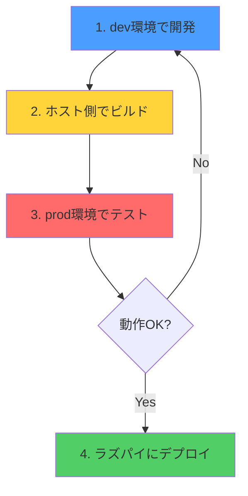

# 🚀 開発・デプロイフロー

本プロジェクトの推奨される開発フローを説明します。

## 📋 フロー概要



---

## ステップ1: dev環境で開発 🔧

### ホットリロード付き開発

```bash
# 方法1: Makefileを使う（推奨）
make docker-dev

# 方法2: docker composeを直接使う
cd deployment/dashboard
docker compose -f docker-compose.dev.yml up
```

### 開発中の確認

- **API**: http://localhost:3000
- **Dashboard**: http://localhost:5173
- **PostgreSQL**: localhost:5432

### コードを変更したら自動でリロード

- API: `nodemon` が自動再起動
- Dashboard: `Vite` が自動リロード

---

## ステップ2: ホスト側でビルド 📦

**重要:** prod環境でテストする前に、必ずホスト側でビルドしてください。

```bash
# 全てビルド
npm run build

# または個別にビルド
npm run build:api        # apps/api/dist に生成
npm run build:dashboard  # apps/dashboard/dist に生成
```

### ビルド結果の確認

```bash
# APIのビルド確認
ls -la apps/api/dist/
# → server.js などが生成されている

# Dashboardのビルド確認
ls -la apps/dashboard/dist/
# → index.html, assets/ などが生成されている
```

---

## ステップ3: prod環境でテスト 🧪

**本番環境（ラズパイ）の動作を再現してテスト**

### prod環境の起動

```bash
# 方法1: Makefileを使う（推奨）
make docker-prod

# 方法2: docker composeを直接使う
cd deployment/dashboard
docker compose -f docker-compose.prod.yml up
```

### アクセス

- **全体**: http://localhost:8080 (Nginx経由)
- **API直接**: http://localhost:3000
- **PostgreSQL**: localhost:5432

### 確認ポイント

- [ ] ページが正しく表示される
- [ ] API通信が正常に動作する
- [ ] データベース接続が正常
- [ ] 本番環境変数（`.env.prod`）が正しい

### 停止

```bash
# 停止
make docker-down

# 完全削除（データも含む）
make docker-clean
```

---

## ステップ4: ラズパイにデプロイ 🚚

### 前提条件

- [x] **ステップ2でビルド済み**
- [x] **ステップ3でprod環境で動作確認済み**
- [x] ラズパイのSSH情報を用意

### デプロイ実行

```bash
# 方法1: Makefileを使う（推奨）
make deploy-pi

# 方法2: スクリプトを直接実行
./deployment/dashboard/scripts/deploy_pi.sh
```

### デプロイスクリプトの動作

`deploy_pi.sh` は以下を自動で実行します：

1. ✅ **フロントエンドをビルド**
   ```bash
   cd apps/dashboard
   npm ci
   npm run build
   ```

2. ✅ **バックエンドをビルド**
   ```bash
   cd apps/api
   npm ci
   npm run build
   ```

3. ✅ **ラズパイにコピー**
   - `apps/dashboard/dist/` → `/opt/waste-dashboard/frontend/dist/`
   - `apps/api/dist/` → `/opt/waste-dashboard/backend/dist/`
   - `apps/api/data/` → `/opt/waste-dashboard/backend/data/`
   - `apps/api/package.json`, `package-lock.json`
   - Nginx設定ファイル

4. ✅ **ラズパイで依存関係をインストール**
   ```bash
   cd /opt/waste-dashboard/backend
   npm ci --omit=dev
   ```

5. ✅ **サービスを再起動**
   ```bash
   sudo systemctl restart waste-backend
   sudo systemctl restart nginx
   ```

### デプロイ後の確認

```bash
# SSHでラズパイに接続
ssh -p <port> <user>@<host>

# サービス状態確認
sudo systemctl status waste-backend
sudo systemctl status nginx

# ログ確認
journalctl -u waste-backend -f
```

---

## 🔧 環境ごとの違い

| 環境 | 目的 | ビルド方法 | データベース | 備考 |
|------|------|-----------|-------------|------|
| **dev** | 開発 | 不要（ホットリロード） | Docker内PostgreSQL | ソースコードをマウント |
| **prod** | 本番再現 | ホスト側で事前ビルド | Docker内PostgreSQL | `dist`をマウント |
| **ラズパイ** | 本番環境 | `deploy_pi.sh`でビルド | ラズパイのPostgreSQL | Systemd + Nginx |

---

## 💡 ベストプラクティス

### ✅ DO（推奨）

1. **dev環境で開発** → ホットリロードで効率的
2. **ビルドは常にホスト側で実行** → 一貫性を保つ
3. **prod環境でテスト** → 本番環境の問題を事前発見
4. **deploy_pi.shでデプロイ** → 自動化されているので安全

### ❌ DON'T（非推奨）

1. **prod環境内でビルドしない** → `dist`がホスト側に残らない
2. **ビルドなしでprod環境起動** → エラーになる
3. **prod環境を飛ばしてデプロイ** → 本番で問題が起きる可能性

---

## 🚨 トラブルシューティング

### prod環境でエラーが出る

**原因:** ビルドしていない

```bash
# 解決方法
npm run build
make docker-prod
```

### deploy_pi.shでエラーが出る

**原因:** SSH接続情報が間違っている

```bash
# 確認方法
ssh -p <port> <user>@<host>
```

### ラズパイでサービスが起動しない

**原因:** 依存関係がインストールされていない

```bash
# ラズパイで実行
cd /opt/waste-dashboard/backend
npm ci --omit=dev
sudo systemctl restart waste-backend
```

---

## 📚 関連ドキュメント

- [DEVELOPMENT.md](./DEVELOPMENT.md) - 開発環境セットアップ
- [deployment/README.md](./deployment/README.md) - デプロイ全体の説明
- [deployment/dashboard/README.md](./deployment/dashboard/README.md) - Dashboard固有の説明

---

## 🎯 まとめ

### 日常的な開発フロー

```bash
# 1. dev環境で開発（毎日）
make docker-dev

# 2. 機能完成後、ビルド
npm run build

# 3. prod環境でテスト
make docker-prod

# 4. OKならラズパイにデプロイ
make deploy-pi
```

**これで安全・確実にデプロイできます！** 🚀
