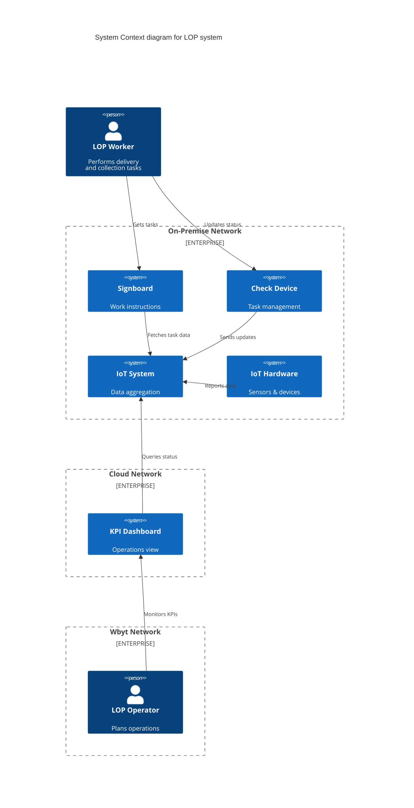

# System Overview

This system is designed for sustainability-related use cases operating in underground spaces within a limited network environment.

The system provides the following capabilities:

## Worker Features
- Provides functionality to support field operations using collection kanbans and similar tools.

## Operations Features
- Provides dashboard functionality to gain insights into site conditions and operational status.

The system is designed to operate on a closed-domain network. External cloud usage is minimized, and Agora is used for system health monitoring (health checks).

# System diagrams
## System context

# Notes
